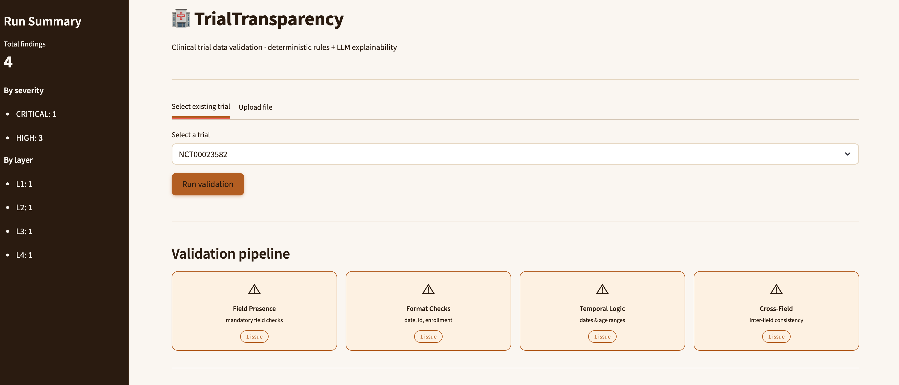
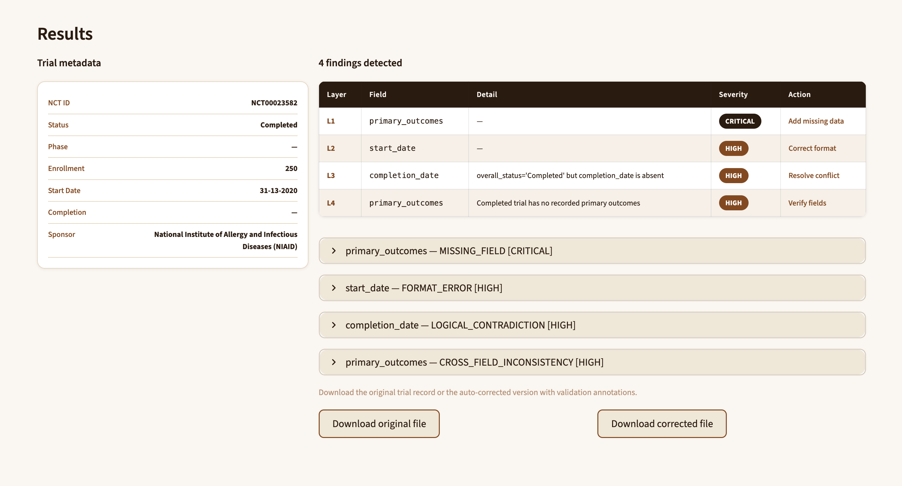

# TrialTransparency

A clinical trial data validation system that combines deterministic rule-based
checking with LLM-generated explanations. Built as a solo engineering project
against the ClinicalTrials.gov v2 API. On 500 trials with seeded synthetic error
injection, the pipeline achieves Recall=0.961 and F1=0.555, with FORMAT_ERROR
detection at F1=0.926.

---

## Dashboard

The Streamlit dashboard (`streamlit_app.py`) provides a browser UI for the full
validation pipeline — select a trial from the database or upload an XML/JSON file,
watch each validation layer run in sequence, inspect findings with LLM
explanations, and download the original or auto-corrected record.

**Validation pipeline & input panel**



**Results panel — findings table, expanders, and download**



```bash
streamlit run streamlit_app.py
```

---

## Architecture

**Tier 1 — Ingestion.** Trials are fetched from the ClinicalTrials.gov v2 JSON
API (`/api/v2/studies`) and written as individual `.json` files under `data/`.
Each file is parsed into a `ClinicalTrialRecord` Pydantic model that captures
fifteen fields — identifiers, dates, enrollment, phase, conditions, outcomes,
eligibility, and sponsor. A normalisation pass converts raw date strings in any
of three formats (MM/DD/YYYY, ISO 8601, "Month YYYY") to strict ISO 8601, maps
free-text phase labels to canonical values ("Phase 1" through "Phase 4", "N/A"),
and title-cases overall status. For evaluation purposes, a seeded error injector
corrupts a copy of the normalised records at known rates — 8% MISSING_FIELD,
12% FORMAT_ERROR, 5% LOGICAL_CONTRADICTION, 4% CROSS_FIELD_INCONSISTENCY — and
stores `InjectedError` ground-truth labels in SQLite alongside the corrupted
records.

**Tier 2 — Validation engine.** Validation runs as a four-level hierarchy. L1
checks field presence: `start_date` and `primary_outcomes` are unconditionally
required; `phase` and `enrollment` are only required for interventional trials;
`start_date` is only flagged when the trial status implies the study has started
(Recruiting, Completed, Terminated, etc.). L2 checks format: dates must match
`^\d{4}(-\d{2}(-\d{2})?)?$` (accepting YYYY, YYYY-MM, and YYYY-MM-DD), `nct_id`
must match `NCT\d{8}`, and enrollment must be a positive integer. L3 checks
temporal and logical consistency: completion date must not precede start date;
completed trials with a start date must have a completion date; minimum age must
not equal or exceed maximum age. L4 checks cross-field dependencies: male gender
with pregnancy-related conditions, Phase 3/4 trials with fewer than 100
enrolled subjects, and completed trials with no recorded primary outcomes. Each
level is independent — findings are collected separately and unioned — so any
single layer can be removed cleanly for ablation without touching the others.
All findings are persisted to a `validation_results` SQLite table with
`(nct_id, error_type, field, severity, detected_at)`.

**Tier 3 — LLM explainability.** For findings flagged as CRITICAL or HIGH
severity, the system builds a role-aware prompt from the record and its findings,
then calls Groq (Llama 3.3 70B) as the primary inference provider and Gemini 2.0
Flash as fallback. Responses are cached on disk using a SHA-256 keyed file per
`(nct_id, error_type)` pair to avoid redundant API calls across runs. The prompt
instructs the model to explain each issue, suggest a corrective action, and note
regulatory traceability considerations — the system is designed with regulatory
traceability in mind, not to assert compliance status.

**Tier 4 — Evaluation harness.** The evaluation methodology uses seeded error
injection (seed=42) so results are exactly reproducible across runs. Metrics are
computed as standard precision/recall/F1 over `(nct_id, error_type)` pairs. The
harness reports per-category breakdowns across all four error types, an ablation
study that disables one validation layer at a time and measures the F1 delta, and
a false-positive source table that attributes each FP to the layer that produced
it by inspecting the finding class name.

---

## Evaluation results

Evaluation was run on 500 trials fetched from ClinicalTrials.gov (default API
sort order, seed=42). The error injector introduced 127 synthetic errors across
the 500 records. Ground-truth labels were stored in SQLite and compared against
all `(nct_id, error_type)` pairs detected by the validation engine.

Overall: Precision=0.390 | Recall=0.961 | F1=0.555 | TP=122 | FP=191 | FN=5

### Per-category results

| Category | TP | FP | FN | Precision | Recall | F1 |
|---|---:|---:|---:|---:|---:|---:|
| MISSING_FIELD | 25 | 130 | 5 | 0.161 | 0.833 | 0.270 |
| FORMAT_ERROR | 63 | 10 | 0 | 0.863 | 1.000 | 0.926 |
| LOGICAL_CONTRADICTION | 17 | 18 | 0 | 0.486 | 1.000 | 0.654 |
| CROSS_FIELD_INCONSISTENCY | 17 | 33 | 0 | 0.340 | 1.000 | 0.507 |

### Ablation results

F1 baseline (all layers active): 0.555

| Layer disabled | F1 | F1 delta vs baseline |
|---|---:|---:|
| L1 (field presence) | 0.681 | +0.126 |
| L2 (format) | 0.322 | −0.233 |
| L3 (temporal logic) | 0.519 | −0.036 |
| L4 (cross-field) | 0.538 | −0.017 |

### FP sources

| Layer | FP count | % of total FPs |
|---|---:|---:|
| L1 — field presence | 145 | 70.0% |
| L2 — format | 10 | 4.8% |
| L3 — temporal logic | 18 | 8.7% |
| L4 — cross-field | 34 | 16.4% |

---

## Key findings

- **FORMAT_ERROR detection is the strongest layer (F1=0.926).** The single
  largest precision improvement in the development cycle was the L2 date regex
  change from `^\d{4}-\d{2}-\d{2}$` to `^\d{4}(-\d{2}(-\d{2})?)?$`, which
  stopped flagging partial dates (YYYY-MM, YYYY) that the v2 API legitimately
  returns for trials where only month or year precision is recorded.

- **L1 (field presence) is the highest-noise layer, producing 70% of all false
  positives.** Field presence cannot be evaluated correctly without
  protocol-level context. A missing `phase` field is valid for observational
  trials and an error for interventional ones. The current implementation
  handles the study_type conditional, but further precision gains require
  richer per-trial context than the v2 API fields provide.

- **Precision (0.390) is lower than recall (0.961) by design.** Clinical data
  validation should prefer false positives over false negatives — a missed data
  quality error has greater downstream consequence than a spurious flag that a
  reviewer clears. The system is tuned accordingly.

---

## Limitations

- **Evaluation uses synthetic error injection, not real-world data quality
  issues.** Injected errors follow known patterns (null fields, invalid date
  strings, date inversions, gender/condition contradictions) at fixed rates.
  Organic errors from real data collection workflows — transcription errors,
  ambiguous protocol updates, partial registry submissions — may have different
  characteristics and be harder to detect.

- **The 500-trial sample is not representative by therapeutic area or trial
  type.** Trials were fetched in default ClinicalTrials.gov API sort order.
  Performance on device trials, expanded access records, or therapeutic-area
  subsets (oncology, rare disease) has not been measured.

- **L1 false positive rate (P=0.161) reflects the fundamental limitation of
  mandatory-field checks without protocol context.** Improving L1 precision
  beyond the current study_type conditional requires per-trial rule sets — for
  example, phase requirements that vary by trial type beyond the
  interventional/observational split, or sponsor-specific submission conventions.

- **LLM explanations are not evaluated for factual accuracy.** The explainability
  layer generates text that is coherent and role-appropriate, but hallucination
  risk is unquantified. Explanations should be reviewed before surfacing to a
  clinical audience.

---

## Setup

```bash
uv sync
cp .env.example .env   # add GROQ_API_KEY and GEMINI_API_KEY
```

```bash
bash scripts/download_sample.sh      # fetch 500 trials from ClinicalTrials.gov v2
python scripts/inject_errors.py      # inject synthetic errors + store ground truth in SQLite
python scripts/run_eval.py           # full eval: overall metrics, ablation, FP breakdown
python scripts/explain_sample.py     # LLM explanations for 10 high-severity findings
uv run pytest tests/ -v              # 13 tests
```

If both API keys are empty, `explain_sample.py` writes `[No API key configured]` in
place of each explanation and still saves the finding metadata.

---

## Stack

Python 3.11+, uv, lxml, Pydantic v2, SQLite (stdlib), Rich, Groq Llama 3.3 70B,
Gemini 2.0 Flash (fallback), pytest.
